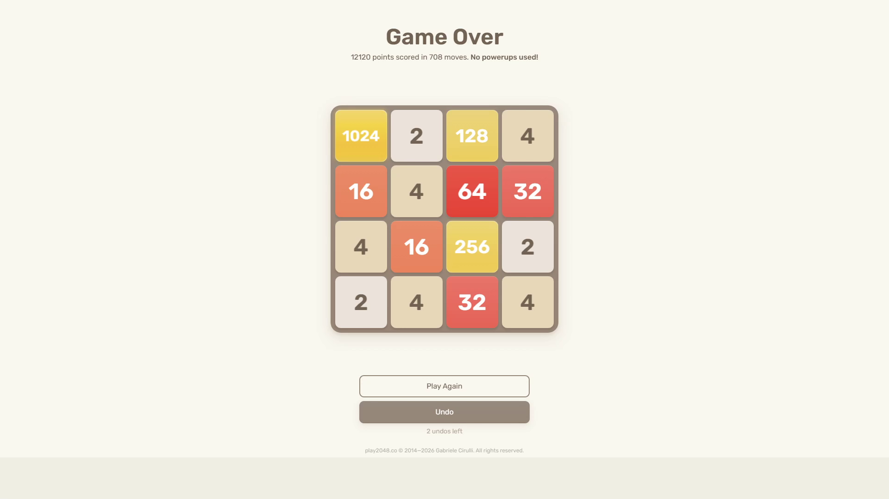

# Test Run #1: Baseline Verification (Default Heuristics)

- **Date**: September 27, 2026
- **Test Type**: Full-system live autonomous gameplay test (End-to-End Hardware-in-the-Loop)
- **Target Game**: Official 2048 Web Client (`play2048.co`)
- **Weights Used**: Default Baseline Snake Heuristics (`DEFAULT_GRADIENT_WEIGHTS`)
- **Hardware/Display Setup**: Dual Monitor 1080p (Game running on Monitor 1, CodeD3mon Telemetry Dashboard on Monitor 2)
- **Perception Mode**: Live OpenCV Zero-Hook Pixel Grab (`mss` + Blue-channel White Text Segmentation)

---

## Run Metrics & Results

| Metric | Measured Value | Notes |
| :--- | :--- | :--- |
| **Max Tile Reached** | **1024** | Tile assembled cleanly in top-left quadrant |
| **Final Game Score** | **12,120** | Confirmed by official game-over screen |
| **Total Moves Executed** | **708 moves** | Zero dropped keystrokes or double-taps |
| **Average Decision Latency** | **~20 ms / move** | Adaptive search depth 3–4 |
| **Search Tree Throughput** | **~48,700 nodes/sec** | Evaluated via 1D bitwise LRU cache |
| **Total Test Session Time** | **5 minutes 20 seconds** | Synchronized with browser slide animations |
| **Vision Misclassifications** | **0** | 100% tile recognition accuracy |

---

## Final Result & Score Screen

The session concluded with an official score of **12,120 points** across **708 moves**, reaching the **1024** tile:

---

## Video Recording & Timelapse

A condensed 20-second high-speed timelapse of the complete 5.3-minute autonomous gameplay session is stored alongside this report:

- **Full-Session Timelapse**: [`test_01_timelapse.mp4`](test_01_timelapse.mp4) (Dual-monitor side-by-side view showing the live 2048 board on the left and the CodeD3mon Telemetry Dashboard computing optimum moves and evaluating ~48,700 nodes/sec on the right).
- **Screenshot Artifact**: [`test_01_final_score.png`](test_01_final_score.png)

---

## Post-Mortem & Technical Observations

### What Worked Well:
1. **Perception Reliability**: The blue-channel text segmentation and topological hole detection (`cv2.RETR_CCOMP`) had a 100% detection rate. 128, 256, and 512 were never confused even once throughout 708 moves.
2. **Animation Synchronization**: The 150ms settle buffer completely eliminated CSS slide blur desyncs. The AI never read a half-slid tile.
3. **Throughput**: Peak search speed regularly exceeded 48,000 nodes/sec with zero CPU throttling.

### Observations on Baseline Play:
- In late-game crowded states ($\le 3$ free cells), the default gradient matrix allowed a 128 tile to appear next to the 1024 corner anchor before completing the lower feeder row.
- These live test observations provide empirical ground-truth data to compare against mutated weight models generated by the in-memory genetic trainer.
