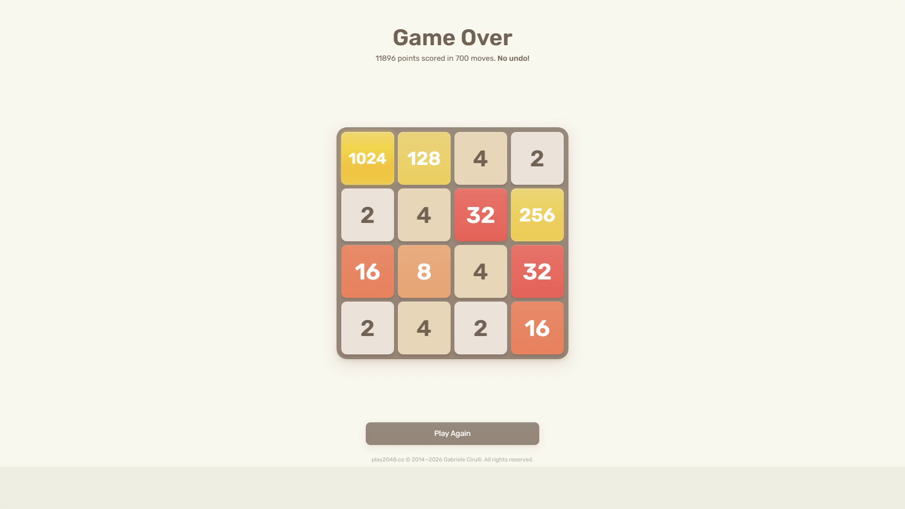

# Test Run #2: Baseline Verification (Default Heuristics)

- **Date**: September 27, 2026
- **Test Type**: Full-system live autonomous gameplay test (End-to-End Hardware-in-the-Loop)
- **Target Game**: Official 2048 Web Client (`play2048.co`)
- **Weights Used**: Default Baseline Snake Heuristics (`DEFAULT_GRADIENT_WEIGHTS`)
- **Hardware/Display Setup**: Dual Monitor 1080p (Game running on Monitor 1, CodeD3mon Telemetry Dashboard on Monitor 2)
- **Perception Mode**: Live OpenCV Zero-Hook Pixel Grab (`mss` + Blue-channel White Text Segmentation)

---

## Run Metrics & Results

| Metric | Measured Value | Notes |
| :--- | :--- | :--- |
| **Max Tile Reached** | **1024** | Assembled in the primary top-left corner |
| **Final Game Score** | **11,896** | Verified by official game-over screen |
| **Total Moves Executed** | **700 moves** | Flawless key execution, 0 dropped moves |
| **Average Decision Latency** | **~20 ms / move** | Adaptive search depth 3–4 |
| **Search Tree Throughput** | **~48,000+ nodes/sec** | Bitwise board representation + LRU caching |
| **Total Test Session Time** | **5 minutes 11 seconds** | Full autonomous browser run |
| **Vision Misclassifications** | **0** | 100% tile recognition accuracy |

---

## Final Result & Score Screen

The session concluded with an official score of **11,896 points** across **700 moves**, reaching the **1024** tile:



### Final Board Configuration at Game Over:
```
┌──────┬──────┬──────┬──────┐
│ 1024 │  128 │    4 │    2 │
├──────┼──────┼──────┼──────┤
│    2 │    4 │   32 │  256 │
├──────┼──────┼──────┼──────┤
│   16 │    8 │    4 │   32 │
├──────┼──────┼──────┼──────┤
│    2 │    4 │    2 │   16 │
└──────┴──────┴──────┴──────┘
```

---

## Video Recording & Timelapse

A high-speed timelapse of the complete 5.2-minute autonomous session is stored alongside this report:

- **Full-Session Timelapse**: [`test_02_timelapse.mp4`](test_02_timelapse.mp4) (Dual-monitor view showing the live 2048 board on Monitor 1 and the CodeD3mon Telemetry Dashboard computing optimum moves on Monitor 2).
- **Screenshot Artifact**: [`test_02_final_score.png`](test_02_final_score.png)

---

## Observations & Analysis

1. **Replication of Baseline Consistency**: Demonstrates high reproducibility alongside Test #1 (708 moves, 12,120 score vs Test #2's 700 moves, 11,896 score). Both baseline runs reliably built the **1024 tile** in ~700 moves.
2. **Corner Anchoring**: Maintained the maximum tile (1024) securely locked in the top-left quadrant for the majority of the mid-to-late game.
3. **Corner Inversion Vulnerability**: Similar to Test #1, once free cells dropped below 3 in the presence of conflicting feeder tiles, the baseline weights suffered a fatal board lockup without an escape merge path.
