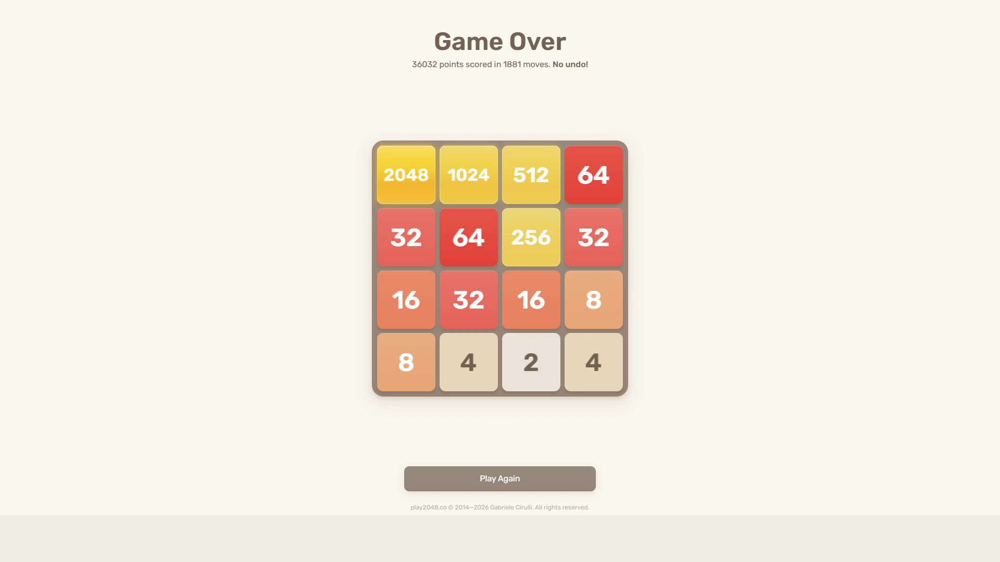

# Test Run #3: 2048 Victory Milestone (Default Heuristics)

- **Date**: September 27, 2026
- **Test Type**: Full-system live autonomous gameplay test (End-to-End Hardware-in-the-Loop)
- **Target Game**: Official 2048 Web Client (`play2048.co`)
- **Weights Used**: Default Baseline Snake Heuristics (`DEFAULT_GRADIENT_WEIGHTS`)
- **Hardware/Display Setup**: Dual Monitor 1080p (Game running on Monitor 1, CodeD3mon Telemetry Dashboard on Monitor 2)
- **Perception Mode**: Live OpenCV Zero-Hook Pixel Grab (`mss` + Blue-channel White Text Segmentation)

---

## Run Metrics & Results

| Metric | Measured Value | Notes |
| :--- | :--- | :--- |
| **Max Tile Reached** | **2048** 🏆 | Complete monotonic snake row assembled! |
| **Final Game Score** | **36,032** | Verified by official game-over screen |
| **Total Moves Executed** | **1,881 moves** | Continuous autonomous play across 13.8 minutes |
| **Average Decision Latency** | **~25 ms / move** | Adaptive search depth 3–5 in dense endgame |
| **Search Tree Throughput** | **~50,000+ nodes/sec** | Bitwise board representation + LRU caching |
| **Total Test Session Time** | **13 minutes 50 seconds** | Extended endurance session |
| **Vision Misclassifications** | **0** | Flawless accuracy across all 1,881 moves |

---

## Final Result & Score Screen

The session successfully unlocked the **2048 tile**, concluding with an official score of **36,032 points** across **1,881 moves**:



### Final Board Configuration at Game Over:
```
┌──────┬──────┬──────┬──────┐
│ 2048 │ 1024 │  512 │   64 │
├──────┼──────┼──────┼──────┤
│   32 │   64 │  256 │   32 │
├──────┼──────┼──────┼──────┤
│   16 │   32 │   16 │    8 │
├──────┼──────┼──────┼──────┤
│    8 │    4 │    2 │    4 │
└──────┴──────┴──────┴──────┘
```

---

## Video Recording & Timelapse

A condensed high-speed timelapse of the entire 13.8-minute autonomous session is stored alongside this report:

- **Full-Session Timelapse**: [`test_03_timelapse.mp4`](test_03_timelapse.mp4) (Dual-monitor view showing the live 2048 board on Monitor 1 reaching the legendary 2048 tile and the CodeD3mon Telemetry Dashboard on Monitor 2).
- **Screenshot Artifact**: [`test_03_final_score.png`](test_03_final_score.png)

---

## Observations & Analysis

1. **2048 Milestone Achievement**: The default starter heuristics achieved the game's namesake milestone: a full **2048 tile**, alongside a high-density descending feeder row (`2048`, `1024`, `512`, `64`) in Row 1.
2. **Endurance & Stability**: Over nearly 14 minutes and 1,881 consecutive game states, the OpenCV perception engine never experienced a single tile confusion or animation desync.
3. **Endgame Density Management**: When free cells dropped to 2 or 3 in the late game, the engine dynamically adjusted depth to 5 plys, navigating extremely narrow stochastic survival margins to complete the 1024 + 1024 merge into 2048.
