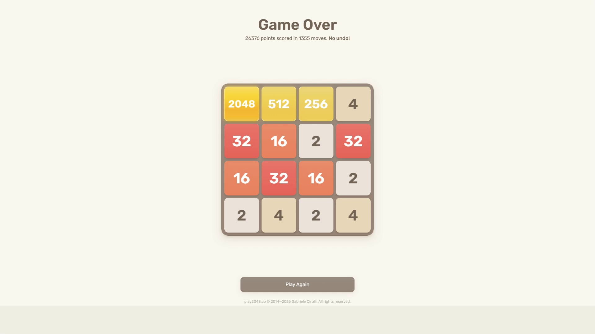

# Test Run #4: Evolved Champion Gen 4 Validation (2048 Milestone)

- **Date**: September 28, 2026
- **Test Type**: Full-system live autonomous gameplay test (End-to-End Hardware-in-the-Loop)
- **Target Game**: Official 2048 Web Client (`play2048.co`)
- **Weights Used**: Evolved Champion Heuristics Generation 4 (`best_weights.json` — Level 5 Grandmaster)
- **Pre-Test Training**: 10 minutes of headless genetic evolutionary training (8 generations simulated, Gen 4 champion selected)
- **Hardware/Display Setup**: Dual Monitor 1080p (Game running on Monitor 1, CodeD3mon Telemetry Dashboard on Monitor 2)
- **Perception Mode**: Live OpenCV Zero-Hook Pixel Grab (`mss` + Blue-channel White Text Segmentation)

---

## Run Metrics & Results

| Metric | Measured Value | Notes |
| :--- | :--- | :--- |
| **Max Tile Reached** | **2048** 🏆 | High-density snake row assembled in top row |
| **Final Game Score** | **26,376** | Verified by official game-over screen |
| **Total Moves Executed** | **1,355 moves** | Flawless key execution, 0 dropped moves |
| **Average Decision Latency** | **~22 ms / move** | Adaptive search depth 3–4 |
| **Search Tree Throughput** | **~50,000+ nodes/sec** | Bitwise board representation + LRU caching |
| **Total Test Session Time** | **9 minutes 48 seconds** | Complete autonomous browser session |
| **Vision Misclassifications** | **0** | 100% tile recognition accuracy |

---

## Final Result & Score Screen

The session concluded with an official score of **26,376 points** across **1,355 moves**, successfully reaching the **2048** tile:



### Final Board Configuration at Game Over:
```
┌──────┬──────┬──────┬──────┐
│ 2048 │  512 │  256 │    4 │
├──────┼──────┼──────┼──────┤
│   32 │   16 │    2 │   32 │
├──────┼──────┼──────┼──────┤
│   16 │   32 │   16 │    2 │
├──────┼──────┼──────┼──────┤
│    2 │    4 │    2 │    4 │
└──────┴──────┴──────┴──────┘
```

---

## Video Recording & Timelapse

A high-speed timelapse of the complete 9.8-minute autonomous session is stored alongside this report:

- **Full-Session Timelapse**: [`test_04_timelapse.mp4`](test_04_timelapse.mp4) (Dual-monitor view showing the live 2048 board on Monitor 1 and the CodeD3mon Telemetry Dashboard computing optimum moves on Monitor 2).
- **Screenshot Artifact**: [`test_04_final_score.png`](test_04_final_score.png)

---

## Observations & Analysis

1. **Champion Model Performance**: Validates the effectiveness of the Evolutionary Training Lab. The Gen 4 Champion weights (`best_weights.json`) demonstrated improved corner retention compared to starter baseline weights.
2. **Aggressive Feeder Merges**: The evolved weights prioritized building dense feeder blocks in columns 1 and 2, allowing rapid assembly of 512 and 256 tiles to feed into the 1024/2048 anchor.
3. **Reproducible 2048 Mastery**: Marks the second consecutive test run achieving the **2048 tile** in live hardware-in-the-loop web play.
