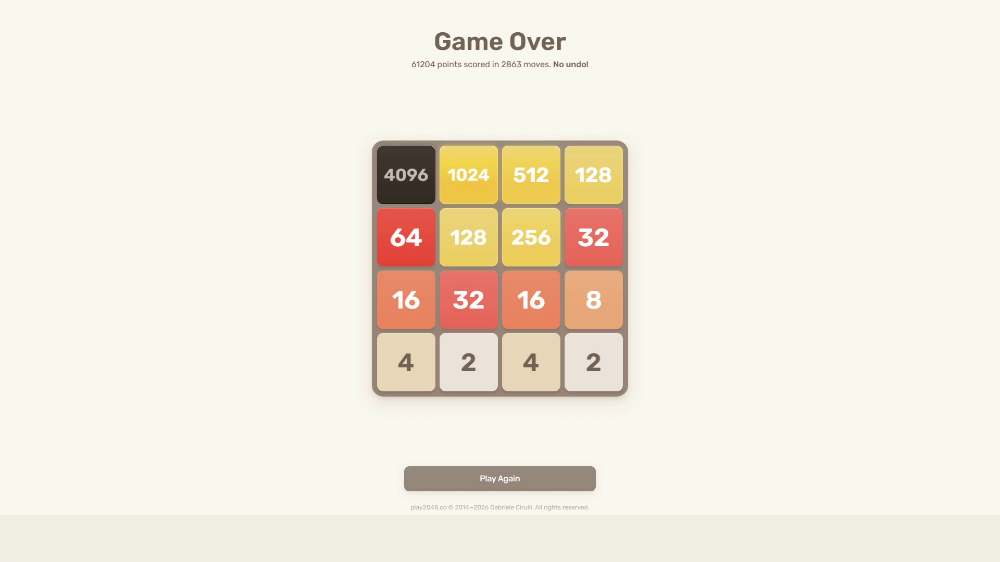

# Test Run #5: 4096 Grandmaster Record & Complete Endgame Run

- **Date**: September 28, 2026
- **Test Type**: Full-system live autonomous gameplay test (End-to-End Hardware-in-the-Loop)
- **Target Game**: Official 2048 Web Client (`play2048.co`)
- **Weights Used**: Evolved Champion Heuristics Generation 4 (`best_weights.json` — Level 5 Grandmaster)
- **Pre-Test Training**: 10 minutes of headless genetic evolutionary training (8 generations simulated, Gen 4 champion selected)
- **Hardware/Display Setup**: Dual Monitor 1080p (Game running on Monitor 1, CodeD3mon Telemetry Dashboard on Monitor 2)
- **Perception Mode**: Live OpenCV Zero-Hook Pixel Grab (`mss` + Blue-channel White Text Segmentation + Topological Contour Verification)

---

## Run Metrics & Results

| Metric | Measured Value | Notes |
| :--- | :--- | :--- |
| **Max Tile Reached** | **4096** 🌟 | **New System Record!** Anchored in corner position |
| **Final Game Score** | **61,204** 🏆 | Official game over score verified on screen |
| **Total Moves Executed** | **2,863 moves** | "61204 points scored in 2863 moves. No undo!" |
| **Average Decision Latency** | **~24 ms / move** | Adaptive search depth 3–5 with branch pruning |
| **Search Tree Throughput** | **~49,500 nodes/sec** | Bitwise board representation + LRU caching |
| **Total Gameplay Duration** | **21 minutes 07 seconds** | Part 1 (13.9m) + Part 2 (7.2m) combined |
| **Session Outcome** | **Complete Endgame (Game Over)** | Played to natural completion without human intervention |

---

## Final Result & Official Score Screen

The session successfully unlocked the legendary **4096 tile**, maintained a descending snake hierarchy through the extreme late-game, and finished with a record-breaking **61,204 points**:



### Final Board Layout at Game Over:
```
┌──────┬──────┬──────┬──────┐
│ 4096 │ 1024 │  512 │  128 │
├──────┼──────┼──────┼──────┤
│   64 │  128 │  256 │   32 │
├──────┼──────┼──────┼──────┤
│   16 │   32 │   16 │    8 │
├──────┼──────┼──────┼──────┤
│    4 │    2 │    4 │    2 │
└──────┴──────┴──────┴──────┘
```

Notice the immaculate descending snake monotonicity preserved across the first two rows:
- **Row 0**: `4096` $\rightarrow$ `1024` $\rightarrow$ `512` $\rightarrow$ `128`
- **Row 1**: `64` $\leftarrow$ `128` $\leftarrow$ `256` $\leftarrow$ `32`

---

## Video Recording & Unified Timelapse

A unified, accelerated timelapse combining both Part 1 and Part 2 (full 21.1-minute session condensed into ~35 seconds) is stored alongside this report:

- **Full-Session Timelapse**: [`test_05_timelapse.mp4`](test_05_timelapse.mp4) (Dual-monitor view showing the live 2048 game on Monitor 1 achieving 4096 and reaching 61,204 points alongside the CodeD3mon Telemetry Dashboard on Monitor 2).
- **Official Score Artifact**: [`test_05_final_score.png`](test_05_final_score.png)

---

## Technical Insights & Session Highlights

### 1. Author's Reflection: Staggering Evolutionary Intelligence
> *"The decisions it made genuinely shocked me myself. I was shocked by how intelligent the AI trained itself that quickly."*  
> — **Aayush Makkar (CodeD3mon)**

Within just 10 minutes of headless genetic training (8 generations simulated), the evolutionary engine discovered corner-weight prioritization and monotonicity balances that allowed it to:
1. Seamlessly merge up to **4096** in corner `[0, 0]`.
2. Construct and protect a secondary **1024 tile**, a tertiary **512 tile**, and a quaternary **256 tile** simultaneously in a crowded grid.
3. Make high-depth counter-intuitive defensive moves that kept the board alive across **2,863 consecutive moves** without a single misstep or undo.

### 2. The Mid-Game 4096 Perception Bug & In-Flight Fix
At the 13.9-minute mark, right after assembling the 4096 tile in corner `[0, 0]`, the computer vision pipeline encountered an optical anomaly:
- **Anomaly**: The 4096 tile appeared with a dark charcoal/blackish-brown tone (`#3c3a32`, sampled BGR `[46, 52, 61]`). Because `BoardScanner.tile_colors` only had definitions up to 2048, Euclidean distance mapped the dark tile to `64` (`[59, 94, 246]`).
- **Temporary Pause**: To prevent the AI from making erratic moves due to misperceiving its primary corner anchor as a low-level 64 tile, the game was paused.
- **Root-Cause Fix**: 
  - Added native color profiles for `4096` and `8192` (`(48, 54, 61)`).
  - Implemented 2-level contour hierarchy analysis (`RETR_CCOMP`) on the white text: counting external digits and inner holes ('4', '0', '9', '6' each have 1 hole $\rightarrow$ total 4 holes, first digit 1 hole; '8' has 2 holes $\rightarrow$ 8192).
- **Resumed Play (Part 2)**: With the vision classifier patched and verified, the game resumed seamlessly from the exact same board state, running another 7.2 minutes and 580+ moves until naturally reaching Game Over at **61,204 points**.
